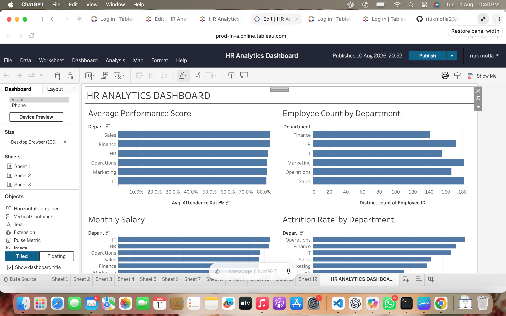

# HR Analytics Dashboard

An interactive HR Analytics Dashboard built using **Tableau, Python, and SQL** to analyze employee performance, attendance, attrition, salary trends, and workforce distribution.

## 📊 Dashboard Preview



## 🎯 Project Objective

The objective of this project is to help HR teams make data-driven decisions by analyzing important workforce metrics such as:

- Employee distribution
- Attendance rate
- Employee attrition
- Average salary
- Monthly salary trends
- Employee performance
- Department-wise workforce insights

## 🚀 Key Features

### 👥 Employee Analytics
- Department-wise employee count
- Workforce distribution
- Employee-level HR data analysis

### 📈 Performance Analysis
- Average performance score by department
- Comparison of employee performance across departments

### 🕒 Attendance Analysis
- Department-wise attendance rate
- Identification of attendance trends

### 💰 Salary Analysis
- Average monthly salary by department
- Department-wise salary comparison
- Salary trend analysis

### 🔄 Attrition Analysis
- Department-wise attrition rate
- Identification of departments with higher employee turnover

## 🛠️ Technologies Used

| Technology | Purpose |
|---|---|
| Python | Data generation and preprocessing |
| SQL | Data analysis and queries |
| Tableau | Interactive dashboard and visualization |
| CSV | Dataset storage |
| GitHub | Version control and project hosting |

## 📁 Project Structure

```text
HR-Analytics-Dashboard/
│
├── README.md
├── hr_data.csv
│
├── python/
│   ├── generate_hr_data.py
│   └── import_to_mysql.py
│
├── sql/
│   └── hr_analysis.sql
│
└── dashboard/
    └── hr-analytics-dashboard.png

## 📊 Tableau Dashboard

[View HR Analytics Dashboard](https://prod-in-a.online.tableau.com/t/ritikmukhiya88-19c1ef762a/views/HRAnalyticsDashboard/HRANALYTICSDASHBOARD)
